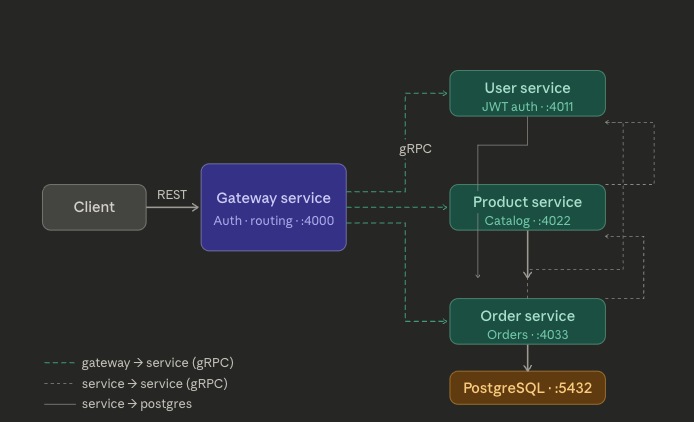
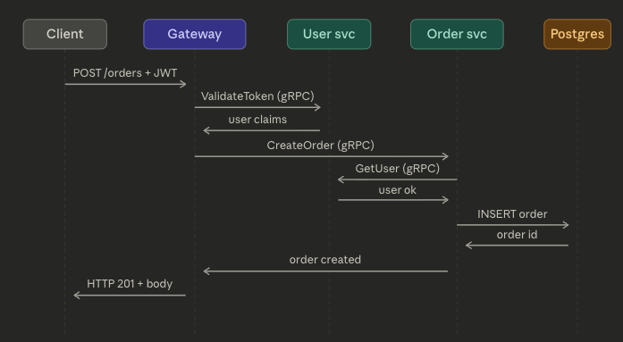

# skyros

This project aims to build a simple e-commerce backend system using a **microservices architecture**, with **gRPC for inter-service communication**and an **API Gateway** to expose a unified RESTful interface to clients. Each core functionality of the e-commerce system is encapsulated in its own microservice to ensure modularity, scalability, and maintainability.

## 📌 Project Overview

This project is a simple e-commerce backend system built using a **microservices architecture**, where each core functionality is isolated into independent services. These microservices communicate using **gRPC**, and a centralized **API Gateway** exposes a unified RESTful API interface to external clients.

The project demonstrates a scalable and maintainable approach to backend development suitable for modern distributed systems.

## 🧩 Key Features

- **API Gateway**
  - Acts as a single entry point for all client requests
  - Routes requests to corresponding microservices using gRPC
  - Handles authentication and request validation

- **Microservices**
  - **User Service**: User registration, login and authentication (JWT)
  - **Product Service**: Product management
  - **Order Service**: Order management

- **gRPC Communication**
  - All internal service communication uses high-performance gRPC
  - Service contracts defined via Protocol Buffers (Protobuf)

- **Database per Service**
  - Each microservice maintains its own isolated database
  - Promotes data encapsulation and service independence

## 🛠 Tech Stack

| Layer              | Technology                              |
|--------------------|-----------------------------------------|
| API Gateway        | gRPC-Gateway                            |
| Service Comm       | gRPC                                    |
| Service Definition | Protocol Buffers (Protobuf)             |
| Language           | Go                                      |
| Database           | PostgreSQL                              |
| Authentication     | JWT                                     |
| Containerization   | Docker / Docker Compose                 |

## 🏗 Architecture



## Request flow — place an order



## 🎯 Project Goals

- Build a modular, maintainable, and scalable e-commerce backend
- Showcase the use of gRPC for efficient inter-service communication
- Use an API Gateway to unify and secure public-facing API access
- Provide a real-world example architecture to extend into production

## Project Structure

```bash
├── docs                        # API Docs
├── gatewayservice              # Service for API Gateway
├── orderservice                # Service for handle order
├── postgres                    # Init Database for microservice
├── productservice              # Service for handle product
├── proto                       # Package for Grpc Library
└── userservice                 # Service for handle user
```

## Getting Started

### Prerequisites

- [Docker](https://www.docker.com/)
- [Docker Compose](https://docs.docker.com/compose/)
- [Go](https://golang.org/)
- [Protobuf Compiler (protoc)](https://grpc.io/docs/protoc-installation/)
- [Database Migration](https://github.com/golang-migrate/migrate/tree/master/cmd/migrate)

## Documentation

Documentation using ReDoc

```bash
cd docs
cp .env.example .env
go run main.go
```

### Running

```bash
cp .env.example .env
# edit .env with your values, then:
make service-up
```
